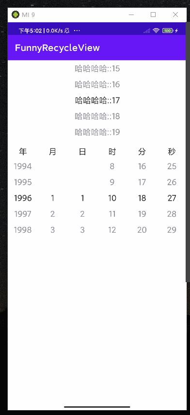

## 花式RecycleView 

RecycleView 绝对是最值得深入学习的 UI 组件;

本项目主要是 学习 RecycleView 的使用, 以及完成一些平常常用的组件;

## 当前已完成:

### 滚动选择系列

 - `WheelLayoutManager` 滚动选择器, //TODO 横向有问题, 循环
 - `TextPickerRecycleView` 字符串选择器
 - `DateTimePickerView` 时间选择器
 
 
 
 
## TODO

- 大转盘
- 弧形联系人选择
- 画廊效果
